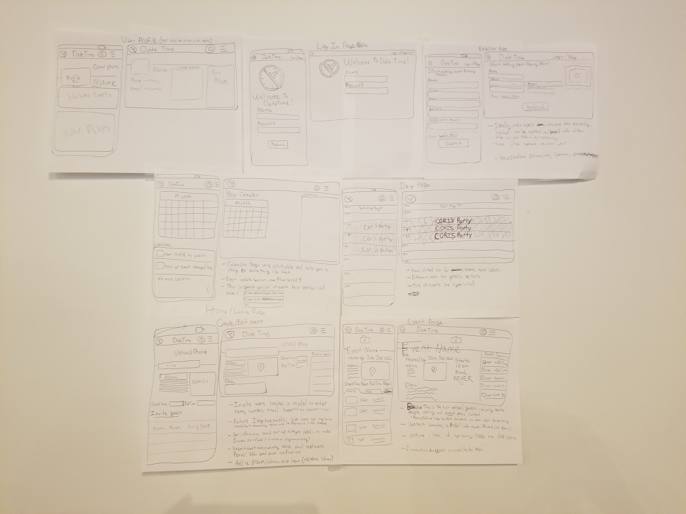
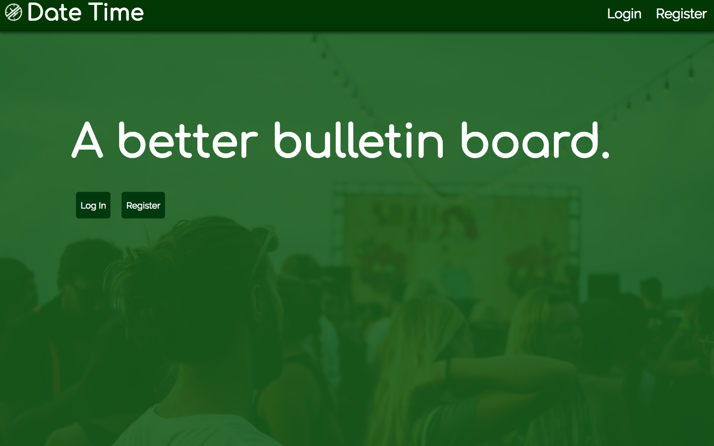

# DateTime 1.0.0
## Created by Andrea McKenzie
  Email:[mckenzie.andrea.m@gmail.com](mailto:mckenzie.andrea.m@gmail.com)
  LinkedIn:[Andrea McKenzie](https://www.linkedin.com/in/andrea-mckenzie/)
  Skype: andrea.michelle.mckenzie

## Billboard... or something more?

**DateTime** is an application dedicated to making event planning easier. In its larval stage, **DateTime** is a billboard demonstrating the name, location, and time frame of your event. **DateTIme** is built on an `Express` Node.js framework and interacts with a `PostGresSQL` database.

## Technologies used 

- Authentication with `passport`
- Postgresql database
- Express on Node.js 
- EJS view engine

## Primary learning opportunities taken

- Upon deployment, filepaths are case-sensitive
- Git does not change the title of nodes unless you change it in the bash
- You can chain multiple SQL queries and subqueries in one model function
   eg:
   ```SQL
   Event.create = (event) => {
  db.none(`INSERT INTO events (title, day, address, time_begins, time_ends, description, host_id) VALUES ($1,$2,$3,$4,$5,$6,$7)`,[event.title, event.day, event.address, event.time_begins, event.time_ends, event.description, event.host_id])
  db.none(`INSERT INTO invitations (event_id, user_id) values ((SELECT plan_id FROM events WHERE host_id = $1 ORDER BY plan_id DESC LIMIT 1), $1);`,[event.host_id]);
  return db.one(`SELECT * FROM events WHERE host_id = $1 ORDER BY plan_id DESC LIMIT 1;`,[event.host_id]);
    }
   ``` 
- Promise values cannot be accessed outside the fetch request


## Database Schema

**DateTime** feeds from three tables: 

### users 
| type/constraint | id | name | phone_number | email | username | password |
| --- | --- | --- | --- | --- | --- | --- |
| Type | SERIAL | VARCHAR(50) | VARCHAR(10) | VARCHAR(255) | VARCHAR(255) | VARCHAR(255) |
| Primary Key | true | false | false | false | false | false |
| References | N/A | N/A | N/A | N/A | N/A | N/A |
| Not Null | true | false | true | true | false | false |
| default | N/A | N/A | N/A | N/A | N/A | N/A |

### events 
| type/constraint | plan_id | title | day | address | time_begins| time_ends | description | host_id |
| --- | --- | --- | --- | --- | --- | --- | --- | --- |
| Type | SERIAL | VARCHAR(50) | DATE | VARCHAR(255) | TIME | TIME | TEXT | INTEGER |
| Primary Key | true | false | false | false | false | false | false | false |
| References | N/A | N/A | N/A | N/A | N/A | N/A | N/A | users(id) |
| Not Null | true | true | true | false | true | false | false | false |
| default | N/A | N/A | N/A | N/A | N/A | N/A | N/A | N/A |


### invitations 
| type/constraint | id | event_id | user_id | status |
| --- | --- | --- | --- | --- |
| Type | SERIAL | INTEGER | INTEGER | VARCHAR(255) |
| Primary Key | true | false | false | false |
| References | N/A | events(plan_id) | users(id) | N/A |
| Not Null | true | false | false | false |
| default | N/A | N/A | N/A | 'pending' |

`invitations` is a join table that binds users to events by having been invited by a user (anyone invited will be submitted to the database, albiet encrypted, and the only person who can get to your information is the user who invited you) rather than just by being the host.

This database structure allows for heighly specific queries to return data in precisely the structure we need to make best use of it later. 

## Wireframes

 

## Screenshots 




###### Future Plans:
-Possible integration of React framework to replace `/views` client-side
- Long-running script to datematch current date against event date and trigger automatic notifications with `node-fcm` and emails with `node-mailer`. 
- Google Maps and Google GeoCoding API to allow for easy visualization of locations and ease of getting directions.
- Inviting other users whether registered users or not (phone numbers and email addresses saved to database and encrypted with `bcryptjs`).
